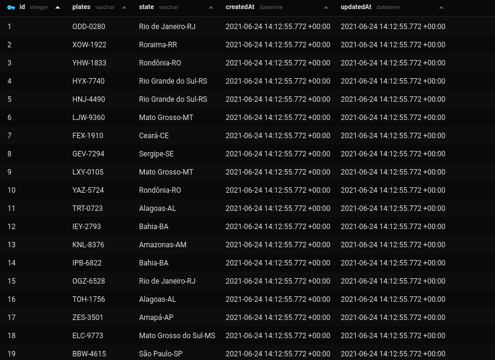
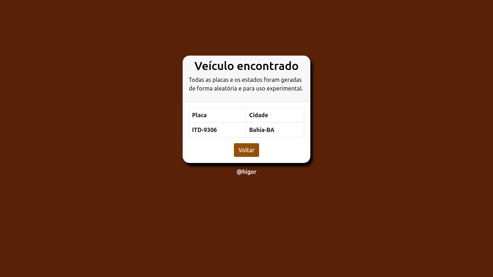

# Consulta-de-placas-de-veiculos

## Projeto 
> Tem como objetivo simular uma busca de sobre informações sobre um veiculo através da placa.

>Pela falta de api públicas com informações sobre dados de veículos, no projeto desenvolvido são gerados de forma aleatória placas e suas possíveis localizações (a escolha da cidade é feita a partir da primeira letra da placa).

Exemplos: 

* A = 'Paraná-PR';

* B = 'São Paulo-SP';

* D = 'Maranhão-MA'; 

* I = 'Bahia-BA';

* O = 'Rio de Janeiro-RJ';

* Z = 'Amapá-AP';

> Número máximo de possibilidades: 176 milhões
seguindo a regra de três letras e quatro números.

> São criadas novas 5 mil placas com suas respectivas localizações no banco de dados quando o usuário acessa a https:localhost:8080/gerar. A geração de novas placas só ocorre quando uma vez após o script iniciado.  

## Instalação

Faça a instalação das dependências do npm e code o script.
   
   
    
    npm install

    npm run dev

## Banco de dados
O banco de dados utilizado é o SQlite então não há a necessidade de instalação.
O banco de dados já vai com 25 mil placas registradas.
  

 
 

## Visual
  

 
  
 
  
 

